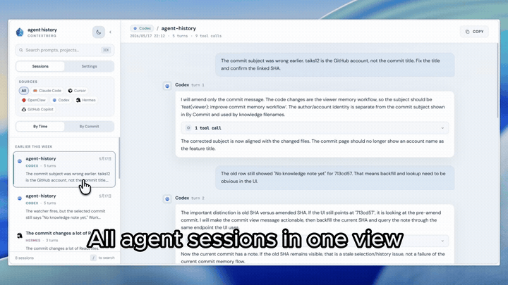

# @contextberg/agent-history

Local-first memory for AI coding agents.

`contextberg` reads local conversation history from Claude Code, Codex, Hermes,
Cursor, OpenClaw, and GitHub Copilot, then links those sessions to git commits.
It can also extract short per-commit knowledge notes so the next agent can
recover why a change happened without asking you to repeat the story.



## What It Does

| Feature | Description |
| --- | --- |
| Unified history viewer | Browse local sessions from Claude Code, Codex, Hermes, Cursor, OpenClaw, and GitHub Copilot in one web UI. |
| Commit linking | Group likely related sessions under recent git commits using repo, time, SHA references, and touched-file overlap. |
| Commit knowledge | Turn each commit into a short "what changed and why" note using your chosen provider, either with your own API key or a Codex subscription. |
| MCP handoff | Hand off the most recent active session's conversation history and learned commit notes to another agent through MCP. |
| Local-first storage | Generated notes stay in the target repo and `~/.agent-history/`; transcript excerpts leave your machine only when commit knowledge runs, and only to the provider you configure. |

## Requirements

- Node.js 22.5 or newer.
- OpenClaw's MCP CLI requires Node.js 22.12 or newer.
- macOS, Linux, and Windows are supported.
- On macOS, Cursor and VS Code/Copilot history is read from
  `~/Library/Application Support/...`; no extra setup is required beyond the
  normal app installation.
- Some macOS GUI MCP clients do not inherit your shell `PATH`. If an MCP client
  cannot find `contextberg`, use the absolute path printed by
  `which contextberg` in that client's MCP config.

## Quick Setup

Launch the viewer without installing anything globally:

```bash
npx @contextberg/agent-history
```

## Full Setup

Install the command, then configure commit knowledge:

```bash
npm install -g @contextberg/agent-history
contextberg setup
```

The setup wizard configures:

1. Provider and model
2. Authentication with your own API key or a Codex subscription
3. Input/output limits
4. The current repo as a watched repo

While the viewer is running, watched repos are monitored for new commits and
knowledge extraction runs in the background.

Launch the viewer any time with:

```bash
contextberg
```

Use Settings in the viewer to edit the knowledge prompt or manage watched repos.
The prompt is stored as `~/.agent-history/system-prompt.txt`, and you can edit
that file directly with `contextberg edit-prompt`.

## Commands

| Command | Description |
| --- | --- |
| `contextberg` | Launch the web viewer and open a browser. |
| `contextberg setup` | Configure provider/model/auth and register the current repo. |
| `contextberg status` | Show config, watched repos, auth status, and recent knowledge extraction runs. |
| `contextberg edit-prompt` | Open the knowledge prompt in your editor. |
| `contextberg uninstall` | Stop watching the current repo and remove legacy hooks if present. |

## Supported History Sources

| Tool | Reader |
| --- | --- |
| Claude Code | `~/.claude/projects/**/*.jsonl` |
| Cursor | Cursor workspace storage |
| Codex | `~/.codex/sessions/` |
| OpenClaw | `~/.openclaw/agents/` |
| Hermes | `~/.hermes/state.db` and legacy session JSON |
| GitHub Copilot | local Copilot chat storage |

Readers fail soft: missing tools or malformed history files return no sessions
instead of taking down the viewer.

## MCP

Add the agent-history MCP server to the agent you use:

```bash
claude mcp add agent-history -- cmd.exe /c npx -y @contextberg/agent-history --mcp
```

```bash
codex mcp add agent-history -- cmd.exe /c npx -y @contextberg/agent-history --mcp
```

```bash
openclaw mcp set agent-history -- cmd.exe /c npx -y @contextberg/agent-history --mcp
```

You can also install the companion skill so agents know how to use the
agent-history MCP tools:

```bash
npx skills add contextberg/agent-history --skill agent-history-cli
```

For other clients that use `mcp.json`, add the same stdio server:

```json
{
  "mcpServers": {
    "agent-history": {
      "command": "cmd.exe",
      "args": ["/c", "npx", "-y", "@contextberg/agent-history", "--mcp"]
    }
  }
}
```

On macOS or Linux, use `npx` directly instead of `cmd.exe`:

```json
{
  "mcpServers": {
    "agent-history": {
      "command": "npx",
      "args": ["-y", "@contextberg/agent-history", "--mcp"]
    }
  }
}
```

Available tools:

- `get_agent_history`: returns bounded recent session history so another agent
  can continue from the active conversation, with learned commit notes included
  by default.
- `get_commit_knowledge`: returns learned per-commit notes.

Tool outputs are capped by default so they can safely fit into another agent's
context window. Caps are configurable in the web settings and MCP arguments.

Set `includeCommitKnowledge: false` on `get_agent_history` when you only want
raw conversation history. Use `get_commit_knowledge` directly when you want to
search learned notes by repo, date, or query.

### MCP Data Formats

#### `get_agent_history`

Input:

```ts
{
  source?: 'claude-code' | 'cursor' | 'openclaw' | 'codex' | 'hermes' | 'copilot';
  date?: string;                 // ISO date, e.g. "2026-05-18"
  maxSessions?: number;
  maxTurnsPerSession?: number;
  maxCharsPerField?: number;
  includeToolCalls?: boolean;     // default: true
  includeToolOutputs?: boolean;   // default: false
  includeCommitKnowledge?: boolean; // default: true
  response_format?: 'markdown' | 'json'; // default: markdown
}
```

Default markdown output:

```md
## Recent Learned Commit Knowledge

### `abc1234` feat(viewer): improve commit memory workflow
*my-app/main | 2026-05-18 | codex/gpt-5.5 | 3 session(s)*

## What was done
- ...

---

### [codex] my-app | 2026-05-18T10:00:00.000Z | cwd:/repo

**[Turn 1] User:**

...

**Assistant:**

...

*Tools used: `shell_command`, `apply_patch`*
```

JSON output (`response_format: "json"`):

```ts
{
  sessions: Array<{
    source: 'claude-code' | 'cursor' | 'openclaw' | 'codex' | 'hermes' | 'copilot';
    project: string;
    startedAt: string;
    endedAt?: string;
    cwd?: string;
    gitBranch?: string;
    turns: Array<{
      userMessage: string;
      assistantText: string;
      tools?: Array<{
        name: string;
        output?: string; // present only when includeToolOutputs=true
      }>;
    }>;
  }>;
  commitKnowledge: Array<{
    sha: string;
    subject: string;
    repo: string;
    repoName: string;
    branch: string;
    authorName: string;
    authoredAt: string;
    extractedAt: string;
    provider: string;
    model: string;
    body: string;
    sessions: Array<{ id: string; score: number; reason: string }>;
    filesChanged: string[];
    inputChars: number;
    outputChars: number;
    durationMs: number;
  }>;
}
```

#### `get_commit_knowledge`

Input:

```ts
{
  repo?: string;              // repo basename, e.g. "my-app"
  since?: string;             // ISO date lower bound on extractedAt
  until?: string;             // ISO date upper bound on extractedAt
  query?: string;             // case-insensitive subject/body substring
  limit?: number;             // default 10, max 20
  maxCharsPerEntry?: number;  // default 1500, max 2000
}
```

Output is markdown:

```md
### `abc1234` feat(viewer): improve commit memory workflow
*my-app/main | 2026-05-18 | codex/gpt-5.5 | 3 session(s)*

## What was done
- ...

## Where it got stuck
- ...

## Open
- ...
```

## Knowledge Storage

Per-commit notes are written to:

```text
.contextberg/knowledge/
  CHANGELOG.md
  YYYY-MM/DD/{slug}.md
  YYYY-MM/DD/.data/{slug}.json
```

A global mirror is also written under:

```text
~/.agent-history/knowledge/<repo>/
```

The repo-local `.contextberg/` directory is ignored by default in this repo, but
you can choose whether to commit generated notes in your own projects.

## Development

```bash
npm install
npm run typecheck
npm run build
npm run dev
```

The web app is a Vite React app under `src/web`. The server and CLI build with
`tsup`.

## Security

This tool reads local agent history and may send selected transcript excerpts to
the provider you configure for knowledge extraction. API keys are stored in
`~/.agent-history/config.json`; Codex OAuth tokens are stored in
`~/.agent-history/codex-auth.json`.

See [SECURITY.md](./SECURITY.md) for the trust model and reporting process.

## License

MIT. See [LICENSE](./LICENSE).
